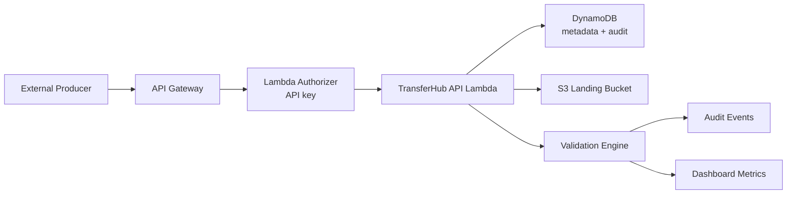

# TransferHub

TransferHub is a serverless TypeScript API for secure, auditable ingestion of external datasets into an S3 data lake. Instead of treating ingestion as a raw file upload problem, it models upstream producers, governed data products, transfer intents, validation outcomes, audit events, and operational metrics as first-class concepts.

## Why data-product-based transfer beats simple upload

A simple upload API tells you that bytes arrived. TransferHub tells you:

- which producer sent the data
- which governed data product the files belong to
- which files were expected for the transfer
- whether the files passed validation
- which audit events occurred across the lifecycle
- how transfer activity rolls up into dashboard metrics

That gives platform teams better traceability, producers clearer contracts, and downstream consumers more confidence in what lands in the lake.

## Architecture



## Core concepts

- `Data Product`: a reusable ingestion contract with expected files, validation rules, ownership, and landing prefix conventions.
- `Transfer Intent`: a single delivery instance for a data product.
- `Transfer Event`: an audit event for lifecycle activity such as creation, URL generation, submission, cancellation, and validation.
- `Validation Result`: a structured record of file checks and rule outcomes.
- `Metrics/Dashboard`: aggregate operational views for monitoring transfer volume, success rate, failures, and recent activity.

## Authentication design

All protected endpoints require:

- `x-api-key: <client-api-key>`

The Lambda authorizer validates the API key against `API_KEYS_JSON` and maps the caller to a producer identity. Every route except `GET /v1/health` is protected by that authorizer.

## Project structure

```text
transferHub/
  src/
    config.ts
    api/
      handler.ts
      routes.ts
      response.ts
    auth/
      authorizer.ts
      apiKey.ts
    services/
      dataProductService.ts
      transferIntentService.ts
      uploadUrlService.ts
      validationService.ts
      transferEventService.ts
      metricsService.ts
      dashboardService.ts
    repositories/
      dynamoRepository.ts
      s3Repository.ts
    models/
      dataProduct.ts
      transferIntent.ts
      transferEvent.ts
      validation.ts
      auth.ts
      metrics.ts
    utils/
      id.ts
      date.ts
      validation.ts
  tests/
  sample_data/
  template.yaml
```

## Environment variables

```env
TRANSFER_TABLE=transferhub-transfers
LANDING_BUCKET=transferhub-landing
AWS_REGION=eu-west-2
UPLOAD_URL_EXPIRY_SECONDS=900
API_KEY_SECRET_ID=
API_KEYS_JSON={"customer-a":"local-api-key-a"}
```

For local development, you can leave `API_KEY_SECRET_ID` empty and use the direct `API_KEYS_JSON` value from `.env`. In AWS, set `API_KEY_SECRET_ID` and let the Lambda functions load API keys from Secrets Manager at runtime.

## Local setup

1. Install dependencies.

```bash
npm install
```

2. Copy the example environment file and adjust values if needed.

```bash
cp .env.example .env
```

3. Run tests.

```bash
npm test
```

4. Build the SAM application.

```bash
sam build
```

5. Run locally with SAM if desired.

```bash
sam local start-api
```

## Running tests

```bash
npm test
```

The test suite covers:

- authorizer validation
- data product creation
- transfer intent creation and lifecycle transitions
- validation pass/fail behavior
- metrics aggregation
- route protection and authorizer enforcement

## SAM deployment

Before deploying:

1. Create the landing bucket manually in S3.
2. Create a Secrets Manager secret containing the API key configuration.

Example Secrets Manager secret JSON:

```json
{
  "API_KEYS_JSON": {
    "customer-a": "replace-with-a-real-api-key"
  }
}
```

Recommended value generation:

- `API_KEYS_JSON`: a JSON object mapping producer ids to API keys

Example local generation commands:

```bash
openssl rand -base64 48
openssl rand -hex 32
```

Those are good for generating client API keys.

```bash
sam build
sam deploy --guided
```

Resources created by `template.yaml`:

- API Gateway REST API
- Lambda Authorizer
- TransferHub API Lambda
- DynamoDB single-table metadata store `transferhub-transfers` with `GSI1`
- IAM permissions for DynamoDB and S3 access

Resources expected to already exist:

- the S3 landing bucket `transferhub-landing`
- the Secrets Manager secret named `api-keys-hub`

SAM CLI deploy packaging is configured via `samconfig.toml` to upload build artifacts into the existing `transferhub-landing` bucket under the `sam-artifacts/transferHub/` prefix. This is separate from the runtime landing data paths, which use the `landing/` prefix.

## API lifecycle with Postman

Create a Postman collection for TransferHub and define these collection or environment variables first:

- `baseUrl` = `http://127.0.0.1:3000`
- `apiKey` = `local-api-key-a`
- `dataProductId` = leave blank initially
- `intentId` = leave blank initially
- `ordersUploadUrl` = leave blank initially
- `manifestUploadUrl` = leave blank initially

For all protected API requests, add these headers:

- `x-api-key: {{apiKey}}`

### 1. Create a data product

Create a `POST` request to:

```text
{{baseUrl}}/v1/data-products
```

Set `Body -> raw -> JSON` to:

```json
{
  "name": "Orders Feed",
  "description": "Daily secure ingestion of order extracts",
  "owner": "Data Platform",
  "environment": "dev",
  "expectedFiles": [
    {
      "fileName": "orders.csv",
      "contentType": "text/csv",
      "minSizeBytes": 1,
      "description": "Daily order file"
    },
    {
      "fileName": "manifest.json",
      "contentType": "application/json",
      "minSizeBytes": 1,
      "description": "Transfer manifest"
    }
  ],
  "validationRules": [
    {
      "ruleType": "contentType",
      "target": "orders.csv",
      "value": "text/csv"
    },
    {
      "ruleType": "fileNameMatches",
      "target": "manifest.json",
      "value": "^manifest\\.json$"
    }
  ]
}
```

After sending the request, save `data.dataProductId` from the response into the `dataProductId` variable.

### 2. Create a transfer intent

Create a `POST` request to:

```text
{{baseUrl}}/v1/data-products/{{dataProductId}}/transfer-intents
```

Set `Body -> raw -> JSON` to:

```json
{
  "environment": "dev"
}
```

After sending the request, save `data.intent.intentId` from the response into the `intentId` variable.

### 3. Generate upload URLs

Create a `POST` request to:

```text
{{baseUrl}}/v1/transfer-intents/{{intentId}}:generateUploadUrl
```

This returns a pre-signed PUT URL for each expected file. Save:

- the `orders.csv` upload URL into `ordersUploadUrl`
- the `manifest.json` upload URL into `manifestUploadUrl`

### 4. Upload files to S3

Create two separate Postman requests that do not use the API key header, because the pre-signed URLs already authorize the upload.

Request 1:

- Method: `PUT`
- URL: `{{ordersUploadUrl}}`
- Header: `Content-Type: text/csv`
- Body: `binary`
- File: choose your local `orders.csv`

Request 2:

- Method: `PUT`
- URL: `{{manifestUploadUrl}}`
- Header: `Content-Type: application/json`
- Body: `binary`
- File: choose your local `manifest.json`

### 5. Submit transfer

Create a `POST` request to:

```text
{{baseUrl}}/v1/transfer-intents/{{intentId}}:submit
```

For the MVP, submit triggers synchronous validation.

### 6. Validate transfer explicitly

Create a `POST` request to:

```text
{{baseUrl}}/v1/transfer-intents/{{intentId}}:validate
```

### 7. View audit events

Create a `GET` request to:

```text
{{baseUrl}}/v1/transfer-intents/{{intentId}}/events
```

Or:

```text
{{baseUrl}}/v1/transfer-events?intentId={{intentId}}
```

### 8. View dashboard and metrics

Create these `GET` requests:

- `{{baseUrl}}/v1/metrics`
- `{{baseUrl}}/v1/dashboard`

## Endpoint summary

- `GET /v1/health`
- `POST /v1/data-products`
- `GET /v1/data-products`
- `GET /v1/data-products/{dataProductId}`
- `POST /v1/data-products/{dataProductId}/transfer-intents`
- `GET /v1/data-products/{dataProductId}/transfer-intents`
- `GET /v1/transfer-intents/{intentId}`
- `POST /v1/transfer-intents/{intentId}:generateUploadUrl`
- `POST /v1/transfer-intents/{intentId}:submit`
- `POST /v1/transfer-intents/{intentId}:cancel`
- `POST /v1/transfer-intents/{intentId}:validate`
- `GET /v1/transfer-intents/{intentId}/events`
- `GET /v1/transfer-events?intentId={intentId}`
- `GET /v1/transfer-intents/{intentId}/validation`
- `GET /v1/metrics`
- `GET /v1/dashboard`

## Notes

- The DynamoDB design follows the requested single-table model with `DATAPRODUCT`, `INTENT`, and `EVENT` item families plus a status GSI.
- Metrics and dashboard aggregation are implemented in the API layer for the MVP and rely on table scans, which is acceptable for early-stage workloads but should evolve into materialized metrics for larger scale.
- Validation is synchronous for the MVP. A future production hardening step would move validation and downstream notifications into asynchronous event-driven flows.
